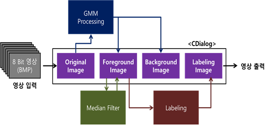
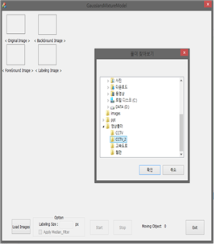
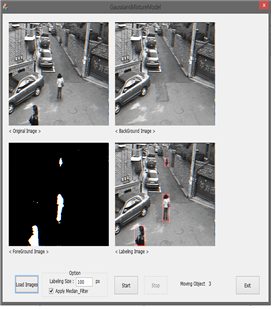
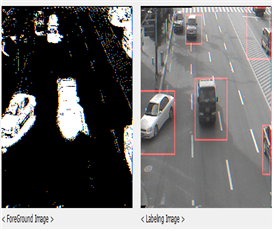
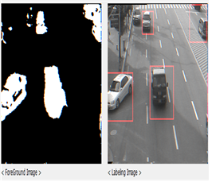

# GaussiansMixtureModel

### 수강과목 : 캡스톤 디자인1(4학년 1학기 졸업작품)

### 프로젝트 개요 :  
변화에 적응 가능한 **가우시안 혼합 모델(Gaussian Mixture Models)** 을 이용하여 전경(움직이는 객체)과 배경을 분리하는 프로그램

### 기간 : 2015.03 ~ 2015.06

### 주요 기능 :
- **[참고논문][1]** 을 바탕으로 영상(Bitmap)의 배경과 전경을 분리하는 알고리즘 구현
- 배경과 분리된 전경 영상의 **salt&pepper Noise** 를 제거하기 위해 **Median Filter** 구현 및 적용
- 배경과 분리된 전경 영상의 객체를 파악하기 위해 **4-neighborhood two-pass** 방식의 **Labeling** 알고리즘 구현
- **MFC** 를 이용하여 프로그램 사용에 편리한 **GUI** 구현

#### **사용 기술** : `MFC`, `C++`, `Non openCV`

#### **사용 툴** : `Visual Studio 2012`

#### [보고서][2]

### SCREEN SHOT
-------

 
  
  

[1]: http://www.cse.psu.edu/~rtc12/CSE586Spring2010/papers/emBGsubtractAboutSandG.pdf
[2]: document/캡스톤1_최종보고서.hwp